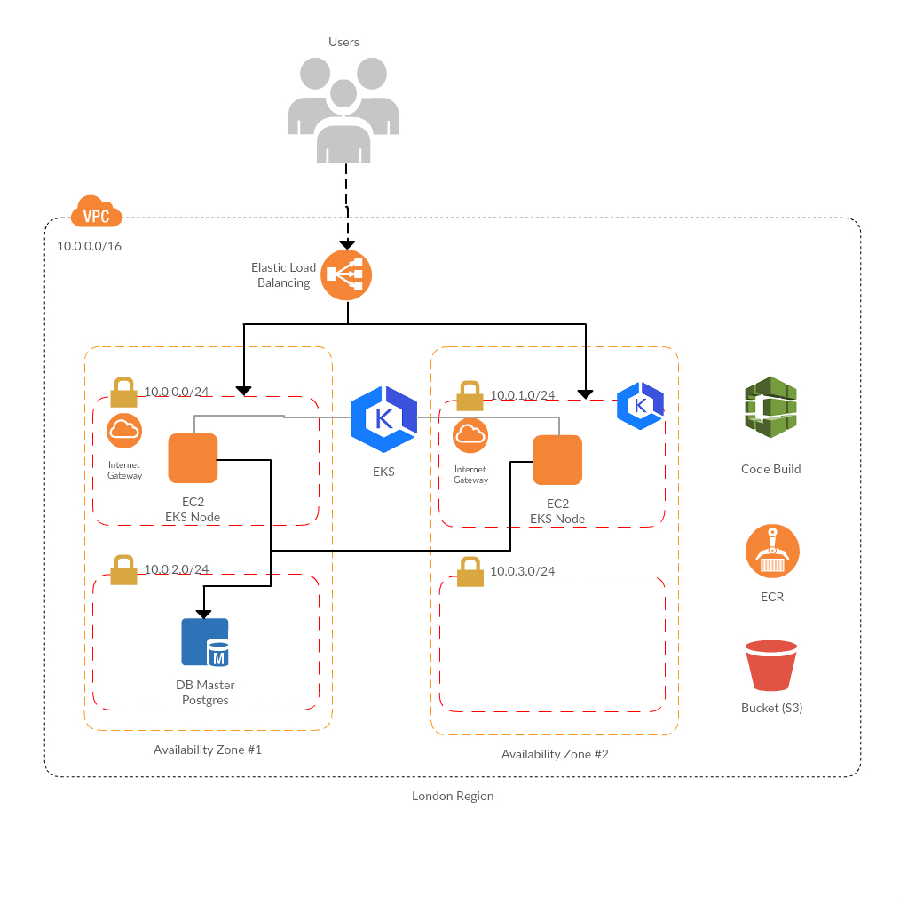
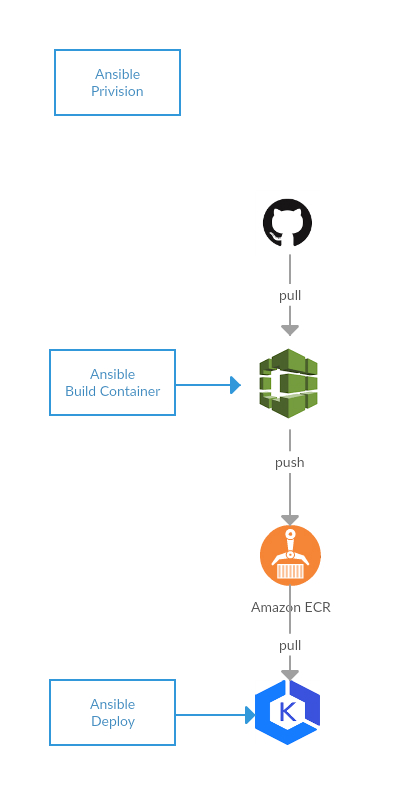

# Revolut App Configuration

The project automates provisioning of a complete infrastructure for end-to-end development and production deployment with no-downtime deployment.

I enjoyed creating an automated configuration that builds the infrastructure and provides automated production deployment.  It has been a challenge to complete it end-to-end in two days.  Perhaps I selected a more complex solution, however, one that reflects a real business situation.





Due to the open ended nature and complexity of the project I find the project as a proof of ability to understand aspects of the fullstack, software development, ability to automate provisioning infrastructure and use best engineering and security practices.  However, I decided on a number of simplifications to make it in time.  Some of the simplifications obviusly don't display the best security and SRE practices, however, that is strictly due the time constraint.

To make this automation fit for production business environment a few selected simplifications would need to be improved, namely secrets management and passwords generation, performance monitoring, alerting and logs management.


# Usage

### Prerequisites 

Install prerequistes,
  - ansible
  - terraform
  - brew install awscli
  - brew install aws-iam-authenticator
  - brew install kubectl

Create AWS user with permissions to provision the infrastructure AWS VPC, EKS, EC2, Code Repository, Code Build, S3.  It is enough for user to have AWS API permissions.

Configure `awscli` with access key and secret,
```
aws configure
```

### How to control the configuration

Use Ansible to provision the infrastructure, build docker images and deploy the images.

```
cd ansible
ansible-playbook provision.yml
ansible-playbook build-container.yml
ansible-playbook deploy.yml
```

Note: git tag to deploy can be any branch or tag such as `master`, `feature/branch` or `v1.0`.


Provisioning can be troubleshooted by,
```
cd terraform
terraform init
terraform plan
terraform apply
```


# Notes

- Secrets need to be properly generated and distributed via, e.g. HashiCorp Vault, in simple instance Ansible Vault or SaaS solutions
- More end-to-end tests need to be performed to fix edge cases that may appear
- Multistage builds shall be used when the app language is compiled such as java, go, crystal.
- Ansible Controller can be provisioned to reduce number of prerequisite tools down to Ansible only


# Caveats

### Bad interpreter

Issue,
```
ansible --version
-bash: /usr/local/bin/ansible: /usr/local/opt/python/bin/python2.7: bad interpreter: No such file or directory
```

Solution,
```
brew link --overwrite ansible
```
